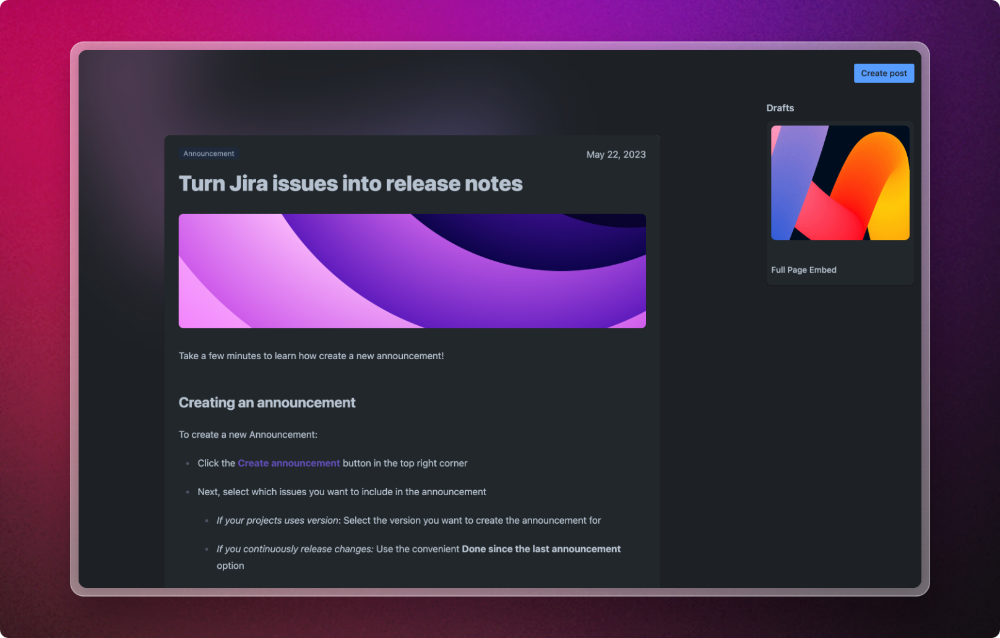

# Welcome to Released

<figure><figcaption>
Released - Release Notes Powered by Jira
</figcaption></figure>


Released is available for Jira via the [Atlassian Marketplace](https://marketplace.atlassian.com).


Say goodbye to the tedious compilation of changes. Released automatically gathers issues related to a release, allowing you to simply drag and drop them into the editor for your announcement.&#x20;

Let our AI copywriter handle the details while you focus on crafting captivating stories for your headline features.&#x20;

No matter what you are building, we will make sure that your announcements always look great.

### Let's get you started!&#x20;
