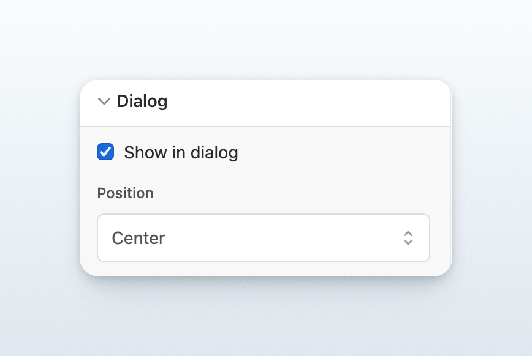

# Embedding the Feedback Form

The form embed enables you to integrate a feedback form seamlessly into your app or website. Feedback from customers and stakeholders lands in the [inbox.md](../../product/feedback/inbox.md "mention") for easy triage.&#x20;


To enable users to log in, you must add the domain's URL to the list of [trusted domains](../../product/administration/trusted-domains.md). The URL must include the subdomain. For example `feedback.example.com`.


## Installation instructions



### Copy the Form ID

[Copy the form ID](../../resources/how-tos/finding-the-channel-id.md) for the embed form.



### Select how to display your form

<div align="left"><figure><figcaption></figcaption></figure></div>

The form can be shown inline, alongside the content where you embed it, or opened programatically.&#x20;



### **Add the embed script**

Add the following code snippet to the `<head>` section of your site.

```markup
<script src="https://embed.released.so/1/embed.js" defer></script>
```



### **Add the released-**&#x66;orm **element to your page**

Add the following code snippet to the `<body>` section of your site. Unlike the widget, the page content renders where you position the element. Ensure you replace the `FORM_ID` attribute.

```markup
<released-form form-id="FORM_ID"></released-page>
```

To automatically authenticate users, you can [implement user verification](implementing-user-verification.md) and pass in the `auth-token` attribute.

```
<released-form form-id="FORM_ID" auth-token="AUTH_TOKEN"></released-page>
```



## Open/Closing the dialog

You can open the form programmatically using the Released API:

```javascript
// Open the feedback form
window.Released.show('form', 'your-form-id');

// Close the feedback form
window.Released.close('form', 'your-form-id');
```

Example with a button:

```jsx
const openFeedback = () => {
  window.Released?.show('form', 'your-form-id');
};

<button onClick={openFeedback}>
  Feedback
</button>
```

## Customize the page&#x20;



Customize the page to match your brand and app design using the page properties. Adjust the title and description, or change the colors according to your preferences.

Please see the documentation for a full list of [configuration options](../../product/portals/portal/announcement-page.md).



## Example

View an example of how to embed the page on [CodePen](https://codepen.io/released/pen/WNaaMNx).
