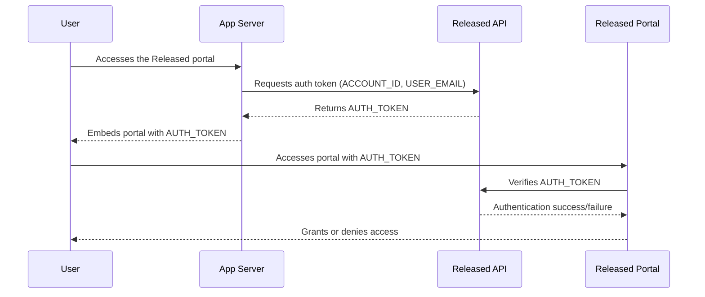

# Implementing User Verification

User verification allows you to securely identify users who access your private widgets or pages. By generating a signed authentication token on your server, you can ensure that only authorized users gain access and can leave feedback in your portals.

User verification is a great way to control access while providing a seamless experience for your team and customers.

## Example Implementations

<a href="https://github.com/released-software/released-embed-demo" class="button secondary" data-icon="github">NextJS demo</a><a href="../../resources/how-tos/how-to-implement-user-verification.md" class="button secondary" data-icon="file-lines">Express demo</a>

## Authentication flow



## Setting up user verification



**Get your shared secret**

First, retrieve your shared secret, which is used to securely sign the user data in the payload.

1. Open the global settings by clicking **Settings** in the top-right corner of the Released overview page.
2. Go to the **User verification** section.
3. Copy your **Shared Secret** – you will use this to generate authentication tokens.


**Keep your secret safe!** Never expose it in client-side code or public repositories.




**Generate an authentication token on your server**

Next, generate an encrypted `AUTH_TOKEN` on your server to securely identify the user.

Send a **POST** request to the Released token API endpoint: `https://accounts.releasedhub.com/auth/api/impersonation/token`

The request must include your `ACCOUNT_ID` and the `CURRENT_USER_EMAIL`. The API responds with an `AUTH_TOKEN` for that user.

The `CURRENT_USER_ID` will be used to identify the user in Released. Make sure that this is a unique identifier for each user in your system. User profiles in Released will use this identifier to match users.

**Profile information**

You can provide optional profile information in the request body to customize the user profile in Released.

```
{
  "account_id": "ACCOUNT_ID",
  "user_id": "CURRENT_USER_ID",
  "user_email": "CURRENT_USER_EMAIL",
  "profile": {
    "name": "The display name",
    "avatar_url": "https://example.com/avatar.png"
  }
}
```

**Request body requirements**

* `user_id` must be unique for each user in your system. The ID cannot be empty but cannot exceed 255 characters. It must match the following regular expression: `^[a-zA-Z0-9:_-]{1,255}$`.
* `user_email` must be the email address of the user.
* (optional) `profile.name` must be a string with a maximum length of 200 characters if the field is provided.
* (optional) `profile.avatar_url` must be a valid URL if the field is provided.

\
**Example request (Node.js)**

```javascript
const response = await fetch("https://accounts.releasedhub.com/auth/api/impersonation/token", {
  method: "POST",
  headers: {
    "Content-Type": "application/json",
    "Authorization": "Bearer SHARED_SECRET" // Your shared secret
  },
  body: JSON.stringify({
    account_id: "ACCOUNT_ID", // Your Released Account ID 
    user_id: "CURRENT_USER_ID", // ID of the current authenticated user
    user_email: "CURRENT_USER_EMAIL" // Email of the current authenticated user 
    profile: {
      name: "The display name", // The display name of the user
      avatar_url: "https://example.com/avatar.png" // The avatar URL of a user profile picture
    }
  }),
});

const json = await response.json();
console.log(json);
```

You can find the `SHARED_SECRET` and `ACCOUNT_ID` values in the **User verification** settings in Released. The `CURRENT_USER_EMAIL` value should be filled in dynamically using the details of the authenticated user in your app or site.



**Pass the authentication token with the embed tag**

Once you’ve generated the token, include it when embedding your portal. It’s valid for two minutes and is exchanged for a three‑day session.

```html
<released-page auth-token="AUTH_TOKEN"></released-page>
```



## Rotating your shared secret

If you need to rotate your shared secret:

1. Generate a new secret in the **User verification** section.
2. Update your server to use the new secret when generating tokens.
3. Ensure all embeds and requests are updated to use tokens generated with the new secret.

## Frequently asked questions

<details>

<summary>What is user verification in Released?</summary>

User verification lets you securely identify users who access your private widgets or pages. It ensures only authorized users can view content and leave feedback in your portals.

</details>

<details>

<summary>How long is an authentication token valid, and when do I need to generate a new one?</summary>

The token lifecycle has two phases:

* Initial use window (2 minutes): Once generated, the token must be passed to a ‎\`\<released-page>\` embed and used to access the portal within two minutes. If the user doesn’t load the portal in that window, the token expires and your server needs to generate a fresh one.
* Active session (3 days): Once the token is successfully used — meaning the portal verifies it with the Released API — the user gets a session that lasts up to three days. During that session they can interact with the portal without needing a new token.

In practice, this means you should generate a token on demand each time a user navigates to a page containing your Released embed, rather than pre-generating and caching tokens. The two-minute window is short enough that stale tokens are a common source of “access denied” errors if tokens are generated too early.

</details>

<details>

<summary>How do I pass the token to my embedded portal?</summary>

Add it to the embed tag as an attribute: ‎`<released-page auth-token="AUTH_TOKEN"></released-page>`

</details>

<details>

<summary>How do I generate an authentication token?</summary>

Send a POST request from your server to ‎`https://accounts.releasedhub.com/auth/api/impersonation/token` with your Account ID, the user’s ID, and their email. Include your shared secret as a Bearer token in the Authorization header.

</details>

## Need help?

If you run into issues, [contact us](https://released.so/support) and we’ll help you get started.
