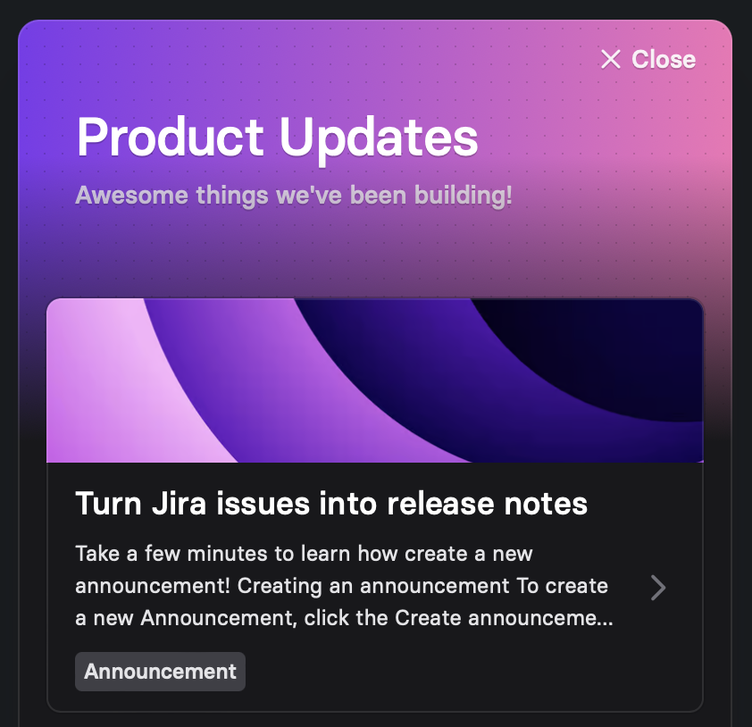

# Widget


<figure><figcaption><p>See a live demo of the widget on <a href="https://codepen.io/released/pen/WNaaMNx">Codepen</a>.</p></figcaption></figure>

## Installation

To add the widget to your website or app, copy the following code snippet into the `<head>` element. Replace the `[PROJECT_ID]` placeholder with the ID found in your widget configuration.&#x20;


You can find a complete version of the snippet in the app, with all details pre-filled.


```
<script type="application/json" id="released-widget-props">
  {
    "id": "[PROJECT_ID]",
    "title": "Changelog",
    "subTitle": "New updates and improvements.",
  }
</script>
<script src="https://embed.released.so/1/widget.js"></script>
```

The above code snippet contains two `script` tags. The first tag contains the configuration properties for the widget, and the second tag loads the widget.&#x20;

The available configuration options are described in the following section.

## Configuration options

Customize your widget to match your brand and app design using the widget properties. Adjust the title, description, colors, positioning, and trigger settings according to your preferences.

The properties are expressed in JSON format and contained in a script tag with the `id="released-widget-props"`.&#x20;

```
<script type="application/json" id="released-widget-props">
```


[widget-configuration.md](../../product-tour/settings/widget-configuration.md)


## Demo

Experience a demo of the widget on [CodePen](https://codepen.io/released/pen/WNaaMNx).
