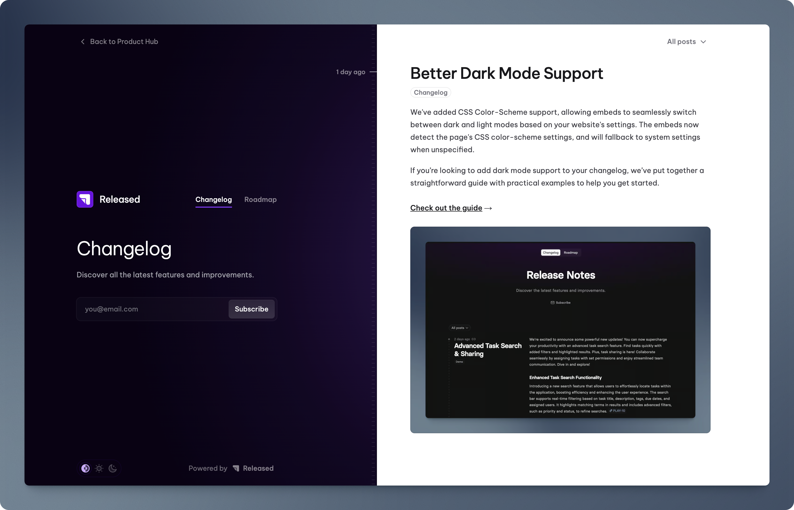

# Product Hub Beta

<figure><figcaption></figcaption></figure>


**Welcome to the Product Hub beta!** \
\
Please note that the Product Hub is still in beta. Found bugs or have suggestions? Please let us know: [https://released.so/support](https://released.so/support)


## Getting started

### Unlocking the beta

1. Click on the "Portal" link in the left-hand navigation in Released.&#x20;
2. Enter the **Konami code** shown below.&#x20;


When it works correctly, you will see the buttons appear on the screen as shown in the video below (you may have click anywhere in the page if it doesn't register your keystrokes).&#x20;


<figure><figcaption>
Konami Code
</figcaption></figure>



### Setting up your Product Hub

Once enabled, your Product Hub will become available on a subdomain of releasedhub.com. We do plan to support custom domains in the future.&#x20;

#### Changing the look and feel&#x20;

You can change the look and feel of the Product Hub via two settings:&#x20;

1. The global settings, which will let you customize the Product Hub overview page
2. The Portal settings, which will let you customize the look and feel of each portal.&#x20;

#### Changing the visibility&#x20;

Currently, the Product Hub doesn't allow access control for each portal individually. Our team is actively working to add this feature soon.&#x20;

Meanwhile, you can decide if a portal is visible on the Product Hub overview page. Note that unlisted portals can still be accessed directly through their URL.

#### Overview video

We have created a quick overview to guide you through the new settings.&#x20;



## Questions & Feedback

If you have any questions or feedback, please get in touch via [https://released.so/support](https://released.so/support).&#x20;

We are looking forward to hear what you think!&#x20;
