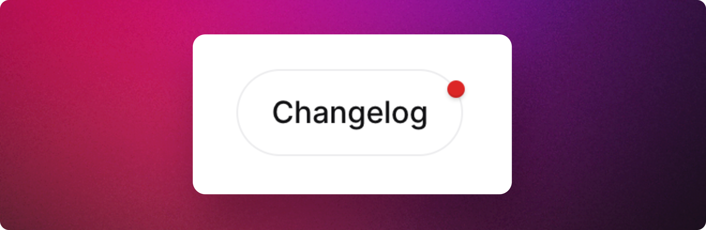

# Framer

Framer let's you design websites on a freeform canvas. Add animations, interactions and a CMS.&#x20;

With **Released + Framer**, you can seamlessly embed a widget or announcement page into your website.&#x20;

This section assumed you are familiar with Framer's code components. If you are new to code components, we recommend you read this page first: [https://www.framer.com/learn/code-components/](https://www.framer.com/learn/code-components/)

## Prerequisite&#x20;

* [ ] [Find the channel ID](../getting-started/setup-guide/finding-the-channel-id.md) for the announcement page and note it down.&#x20;

## Adding the embed code

Copy the following code snippet into the `<head>` element of your page.&#x20;

1. Click on the ⚙️ icon in the top right of the header in Framer.&#x20;
2. Click on **General**.
3. Scroll down to the **Custom Code** section.&#x20;
4. Insert the following code in the **End of \<head> tag** panel.&#x20;

```html
<script src="https://embed-staging.released.so/1/embed.js"></script>
```

Alternatively, you have the option to include the code in the section of the specific page where you wish to display the announcement page. However, considering that you may want to incorporate a notification badge in other sections of the website as well, it is advisable to follow the instructions mentioned above and add it in the General section.

## Adding the announcement page component

We have created a announcement page component that you can copy and paste into your Framer design view. Simply select the layer where you want to insert the announcement page and paste the URL below into the layer.&#x20;

```url
https://framer.com/m/Announcement-page-eOYM.js@bc0W7asRO2QObTu0uejA
```

The component supports a number of properties that can be configured via the UI to adjust the look and feel.&#x20;

Make sure you enter the [Channel ID](../getting-started/setup-guide/finding-the-channel-id.md) for your announcement page. &#x20;

<figure><figcaption><p>Properties of the ReleasedPage Webflow Component</p></figcaption></figure>

<details>

<summary>See the component code</summary>

To create a new code component go to **Assets → Code** and click the plus button. Replace the **CHANNEL\_ID** placeholder with your announcement page **channel-id**.&#x20;

Customize the properties of the `<released-page>`tag at the bottom with your preferred configuration. For further details on the available options, refer to the [announcement-page.md](../product-tour/settings/announcement-page.md "mention") documentation.&#x20;

```tsx
// We need to define an interface for our release page custom html component.
declare global {
    namespace JSX {
        interface IntrinsicElements {
            // The name of the custom component and the available attributes
            "released-page": {
                "channel-id": string
                "color-scheme"?: string
                "color-primary"?: string
                "header"?: string
                "top-offset"?: string
            }
        }
    }
}

// This is the output of our custom component that will be rendered in the page.
export default function Released_page(props) {
    return (
        <>
            <released-page
                channel-id="CHANNEL_ID"
                header="true"
                color-scheme="light"
                top-offset="60"
            ></released-page>
        </>
    )
}
```

</details>

## Creating the badge component


<figure><figcaption><p>Add a notification badge to a link or a button.</p></figcaption></figure>

* To create the badge code component go to **Assets → Code** and click the plus button.&#x20;
* Delete the Framer example code and copy and paste the following code into the editor:

```tsx
// We need to define an interface for our release page custom html component.
declare global {
    namespace JSX {
        interface IntrinsicElements {
            // The name of the custom component and the available attributes
            "released-badge": {
                "channel-id": string
            }
        }
    }
}

// This is the output of our custom component that will be rendered in the page.
export default function Released_badge(props) {
    return (
        <>
            <released-badge channel-id="CHANNEL_ID"></released-badge>
        </>
    )
}
```

3. Replace the **CHANNEL\_ID** placeholder with your announcement page **channel-id**.&#x20;
4. Place the badge component next to your navigation element or button.
5. Use CSS added to the [**Custom Code**](framer.md#adding-the-embed-code) section to [adjust the positioning of the badge](../product-tour/settings/announcement-page.md#adjusting-the-position-of-the-badge).&#x20;

