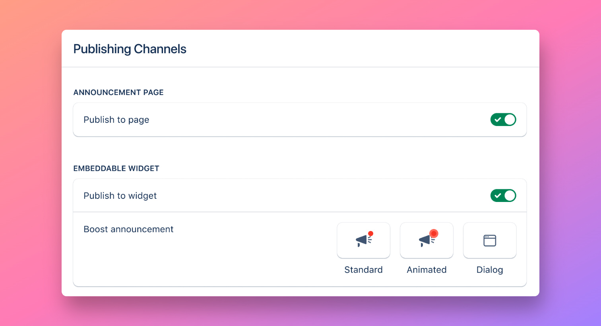
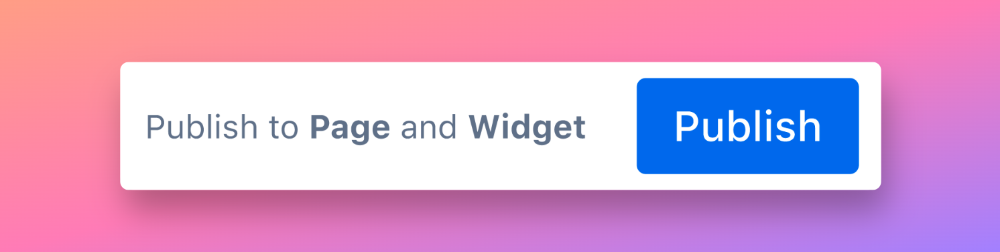

# Publishing

### Publishing channels&#x20;

If you have multiple channels set up, you you have the choice to publish an announcement to all channels or to specific channels only.&#x20;

<figure><figcaption>
Channel configuration
</figcaption></figure>


**Scenario:** Announcing an upcoming conference. \
The in-app widget is the perfect channel for these types of temporary announcements. You can choose to publish this announcement to the in-app widget only without it appearing on the public release notes page.&#x20;


### Publishing an announcement

<figure><figcaption></figcaption></figure>

To make your announcement public, simply hit the <mark style="background-color:blue;">Publish</mark> button located at the bottom of the announcement editor.

