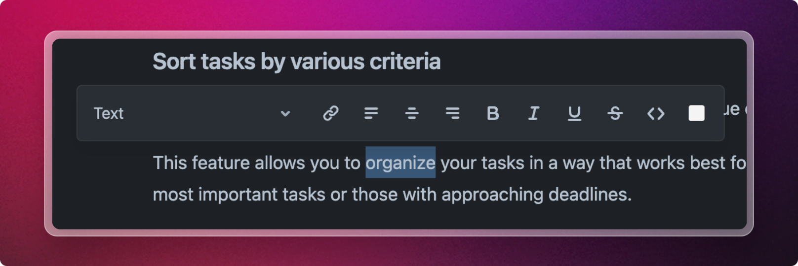

# Editor

## The Basics

The text editor provides comprehensive support for Markdown elements, allowing you to write or paste Markdown text that will be automatically converted into rich text.&#x20;

### Slash "/" Command

Type `/` at the beginning of a line to open the Slash Command dialog. The dialog presents an ever-expanding list of content blocks for you to choose from. Narrow down the options by typing to filter the list, or select a specific item from the menu to insert the corresponding block into the editor.

<figure><figcaption>
Slash "/" Command Menu
</figcaption></figure>

### Toolbar

Moreover, you can utilize the toolbar to easily apply styling to your text. Just highlight the desired word or phrase, and the toolbar will appear, offering a variety of formatting options.

<figure><figcaption>
Select text to reveal the formatting toolbar
</figcaption></figure>

###
