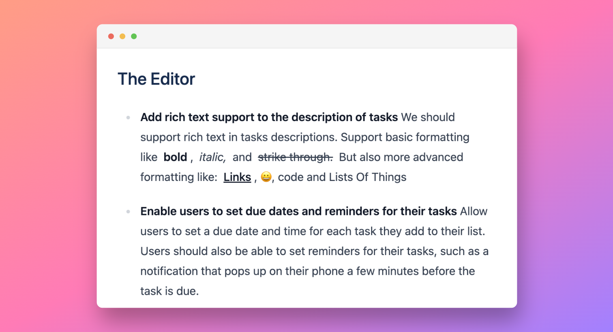

# Editor

<figure><figcaption></figcaption></figure>

Text editor offers extensive support for Markdown elements. You can easily write or paste Markdown text, and our system will automatically convert it into rich text. Additionally, you can use the toolbar to apply styling to your text. Simply highlight the desired word or phrase, and the toolbar will pop up, giving you a range of formatting options.

### Keyboard shortcuts

Most of the core extensions register their own keyboard shortcuts. Depending on what set of extension you use, not all of the below listed keyboard shortcuts work for your editor.

#### Essentials

| Command                  | Windows/Linux         | macOS             |
| ------------------------ | --------------------- | ----------------- |
| Copy                     | `Control` `C`         | `Cmd` `C`         |
| Cut                      | `Control` `X`         | `Cmd` `X`         |
| Paste                    | `Control` `V`         | `Cmd` `V`         |
| Paste without formatting | `Control` `Shift` `V` | `Cmd` `Shift` `V` |
| Undo                     | `Control` `Z`         | `Cmd` `Z`         |
| Redo                     | `Control` `Shift` `Z` | `Cmd` `Shift` `Z` |
| Add a line break         | `Shift` `Enter`       | `Shift` `Enter`   |

#### Text Formatting

| Command       | Windows/Linux         | macOS             |
| ------------- | --------------------- | ----------------- |
| Bold          | `Control` `B`         | `Cmd` `B`         |
| Italicize     | `Control` `I`         | `Cmd` `I`         |
| Underline     | `Control` `U`         | `Cmd` `U`         |
| Strikethrough | `Control` `Shift` `X` | `Cmd` `Shift` `X` |
| Highlight     | `Control` `Shift` `H` | `Cmd` `Shift` `H` |
| Code          | `Control` `E`         | `Cmd` `E`         |

#### Paragraph Formatting

| Command                 | Windows/Linux         | macOS             |
| ----------------------- | --------------------- | ----------------- |
| Apply normal text style | `Control` `Alt` `0`   | `Cmd` `Alt` `0`   |
| Apply heading style 1   | `Control` `Alt` `1`   | `Cmd` `Alt` `1`   |
| Apply heading style 2   | `Control` `Alt` `2`   | `Cmd` `Alt` `2`   |
| Apply heading style 3   | `Control` `Alt` `3`   | `Cmd` `Alt` `3`   |
| Apply heading style 4   | `Control` `Alt` `4`   | `Cmd` `Alt` `4`   |
| Apply heading style 5   | `Control` `Alt` `5`   | `Cmd` `Alt` `5`   |
| Apply heading style 6   | `Control` `Alt` `6`   | `Cmd` `Alt` `6`   |
| Ordered list            | `Control` `Shift` `7` | `Cmd` `Shift` `7` |
| Bullet list             | `Control` `Shift` `8` | `Cmd` `Shift` `8` |
| Task list               | `Control` `Shift` `9` | `Cmd` `Shift` `9` |
| Blockquote              | `Control` `Shift` `B` | `Cmd` `Shift` `B` |
| Left align              | `Control` `Shift` `L` | `Cmd` `Shift` `L` |
| Center align            | `Control` `Shift` `E` | `Cmd` `Shift` `E` |
| Right align             | `Control` `Shift` `R` | `Cmd` `Shift` `R` |
| Justify                 | `Control` `Shift` `J` | `Cmd` `Shift` `J` |
| Code block              | `Control` `Alt` `C`   | `Cmd` `Alt` `C`   |
| Subscript               | `Control` `,`         | `Cmd` `,`         |
| Superscript             | `Control` `.`         | `Cmd` `.`         |

#### Text Selection

| Command                                           | Windows/Linux         | macOS             |
| ------------------------------------------------- | --------------------- | ----------------- |
| Select all                                        | `Control` `A`         | `Cmd` `A`         |
| Extend selection one character to left            | `Shift` `←`           | `Shift` `←`       |
| Extend selection one character to right           | `Shift` `→`           | `Shift` `→`       |
| Extend selection one line up                      | `Shift` `↑`           | `Shift` `↑`       |
| Extend selection one line down                    | `Shift` `↓`           | `Shift` `↓`       |
| Extend selection to the beginning of the document | `Control` `Shift` `↑` | `Cmd` `Shift` `↑` |
| Extend selection to the end of the document       | `Control` `Shift` `↓` | `Cmd` `Shift` `↓` |

####
