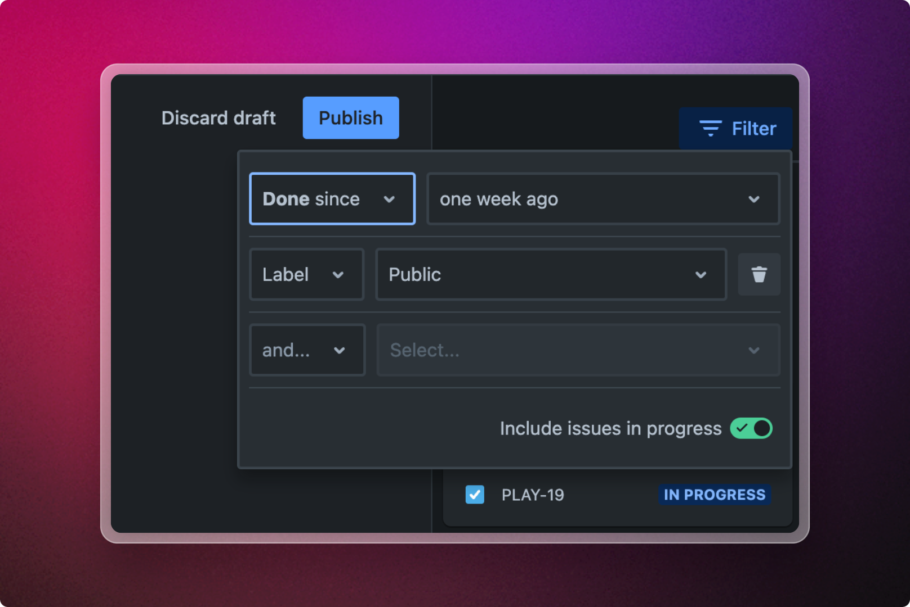

# Staging Area

<figure><figcaption>
Issue filter in the staging area
</figcaption></figure>

The panel on the right hand side of the post editing view is called the staging area.&#x20;

The staging area makes it a breeze to review issues before they get added to the announcement. Issues are sorted by type, so you can easily spot new features, minor improvements, and bug fixes.

### Filter

If you're unable to locate a particular feature that you were expecting to see in the release, don't fret. The filter functionality enables you to customize the display of issues in the staging area.

#### Available filters

<table><thead><tr><th width="260.5">Filter</th><th>Description</th><th data-hidden></th></tr></thead><tbody><tr><td><strong>Resolved since</strong> </td><td>Include issues resolved since a specific date.</td><td></td></tr><tr><td><strong>With fix for version</strong> </td><td>Include issues with a specific fix for version. </td><td></td></tr><tr><td><strong>Label</strong></td><td>Include issues with a specific label</td><td></td></tr></tbody></table>

### Adding issues to the announcement

To add an issue to the announcement, simply drag and drop the issue from the staging area into the editor. By default, the summary and the description of the issue will be added.&#x20;


Drag an issue onto a designated block, indicated by the caret, and the inserted text will adopt the block's formatting. For instance, if you drag an issue onto a bullet point block, the issue details will be added as a bullet point.


#### Adding multiple issues

Inserting individual issues can be a tedious task, especially for large releases. Fortunately, you have the option to select and insert multiple issues simultaneously.


Bulk adding issues


To select multiple issues either:&#x20;

* Press `Cmd/Ctrl` and click on multiple issues.&#x20;
* Click to select the first issue. Then press `Shift` and click the last issue. This will select the first issue, the last issue, and all issues in between.&#x20;
