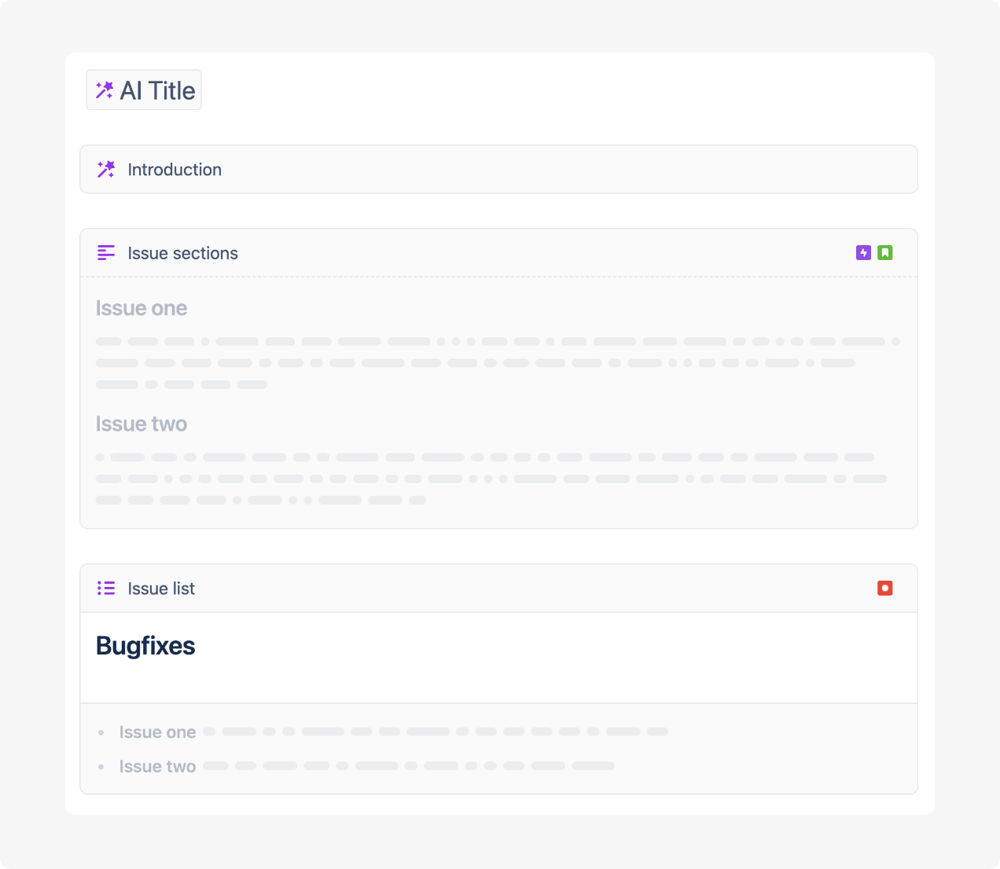

# Templates

## Introduction

Release notes are an essential tool for communicating product updates, bug fixes, and new features to users. To streamline the process of creating effective and consistent release notes, Released features a powerful templating feature. Templates simplify the creation of changelogs, release notes, and other announcements by providing a structured yet customizable framework.

## Getting Started with Templates

### Creating a New Template

1. Navigate to the **Templates** section of your **Settings**.
2. Click on **Create** to create a new template.
3. Choose an existing template to start with or start from scratch.
4. Customize the template with placeholders and formatting options as needed.
5. Save your template with a descriptive name for future use.

### Editing an Existing Template

1. Navigate to the **Templates** section of your **Settings**.
2. Select the template you wish to edit from the list.
3. Modify the template content and placeholders.
4. Save your changes to update the template.

<figure><figcaption>
Template Example
</figcaption></figure>

## AI Blocks

Our template feature includes dynamic placeholders that can be populated using AI-generated content. These placeholders ensure that your release notes are informative, consistent, and engaging.

### Title

Generates a title based on the post content.&#x20;

**Usage**: Type `/` while editing the title field and select **Title** in the AI blocks section.&#x20;

**Settings:**

* **Custom prompt:** Personalize the title with a custom AI prompt. &#x20;

### Introduction

Generates an introduction based on the post content.&#x20;

**Usage**: Type `/` in the content editor and select **Introduction** in the AI blocks section.&#x20;

**Settings:**

* **Custom prompt:** Personalize the introduction with a custom AI prompt. &#x20;

### Issue sections

This block generates descriptions for all issues of the specified type(s) in paragraph format.&#x20;

For example: If the selected issue type was "Story", and the filter for the release announcement contains 3 stories, this block will create 3 sections, with a heading for each story.&#x20;


We recommend to use this block style for major features and improvements.


**Usage**: Type `/` while editing the title field and select **Issue sections** in the AI blocks section.&#x20;

**Settings:**

* **Issue Types:** Select one or more issue types to include in this block. A description will be generated for every issue of this type that matches the filter criteria for a post.&#x20;
* **Custom prompt:** Personalize the AI prompt used to generate the description.  &#x20;

### Issue lists

This block generates descriptions for all issues of the specified type(s) in a list format.&#x20;

For example: If the selection issue type was "Bug", and the filter for the release announcement contains 5 bugs, this block will create 5 bullets points, one for each bug.&#x20;


We recommend to use this block style for bugfixes and small imrovements.&#x20;


**Usage**: Type `/` while editing the title field and select **Issue lists** in the AI blocks section.&#x20;

**Settings:**

* **Conditional title and description:** This block contains a text area allowing for adding a title and description. If no issues match this section, this text will not be shown.&#x20;
* **Issue Types:** Select one or more issue types to include in this block. A description will be generated for every issue of this type that matches the filter criteria for a post.&#x20;
* **Custom prompt:** Personalize the AI prompt used to generate the description.  &#x20;

## Basic Formatting Support

Aside from the above AI blocks, you can use most of the regular blocks available in the standard editor for templates as well. For more details, see the [editor](../editor/ "mention") documentation.


#### Images

We currently do not support adding images in templates. However, you can add images once the post was generated.&#x20;


## Tips for Effective Release Notes

* **Be Concise**: Use the AI Summary for a quick overview and detailed sections for in-depth information.
* **Be Clear**: Utilize headings and lists to structure your content for better readability.
* **Keep it Consistent**: Stick to your template for a uniform look across all release notes.

By leveraging the templating feature, you can efficiently produce professional and comprehensive release notes that keep your users informed and engaged with every product update.

## Frequently Asked Questions

### What happens if an issue in the template already has a description?

That depends.

**If the description is stored in a** [released-description-field.md](../../getting-started/setup-guide/released-description-field.md "mention"): Released will use that description in the template and not generate a new description.

**If the description is stored in the issue properties (the default)**: Released will overwrite the description only if a **custom prompt** was used in the template. &#x20;
