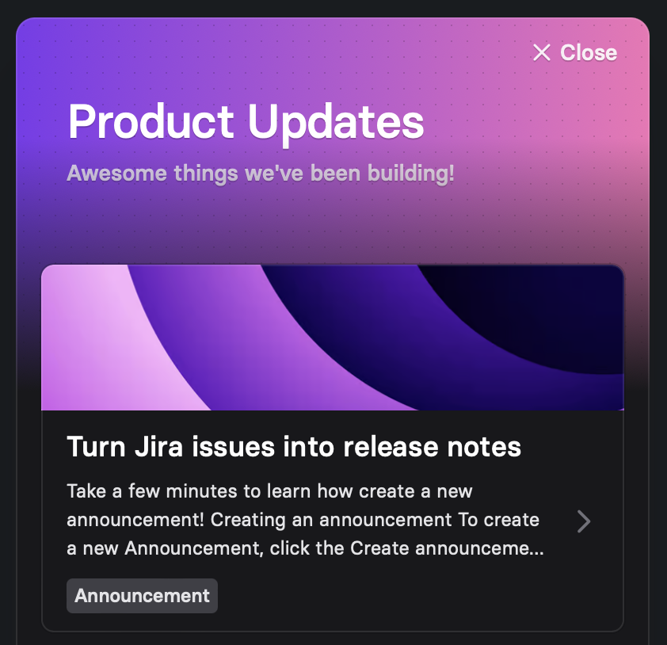

# Widget

The announcement widget offers a seamless way to integrate release notes into your application or website. With a simple click on a trigger in form of a link or button, users can access a dialog box displaying the most recent announcements. Additionally, the trigger conveniently displays a badge indicating the presence of new announcements.

## Demo

Experience a demo of the widget on [CodePen](https://codepen.io/released/pen/WNaaMNx).

<figure><figcaption></figcaption></figure>

## Installation

To add the announcement page to your website, simply follow the installation instructions in the app.&#x20;

* Navigate to the Released **Settings** in your Jira project
* Click the **Widget** menu item.
* Click the **Installation instructions** at the top right above the preview.&#x20;
* Follow the installation instruction in the slide out panel.&#x20;

## Configuration options

Customize your widget to align with your brand and application design by leveraging the `<released-widget>` properties. Tailor the title, description, colors, positioning, and trigger settings to suit your preferences and create a seamless integration with your app's visual identity.

The properties are specified as attributes within the `<released-widget>` custom HTML element.

### **Widget Properties**&#x20;

The following customisation options are available for the widget.&#x20;

<table data-full-width="false"><thead><tr><th width="204">Property</th><th width="588">Description</th></tr></thead><tbody><tr><td><code>channel-id</code></td><td>The ID of the release notes channel.</td></tr><tr><td><code>position</code></td><td>The position of the widget. Can be <code>top-left</code>, <code>top-right</code>, <code>bottom-right</code>, or <code>bottom-left</code>.</td></tr><tr><td><code>trigger</code></td><td>A <code>string</code> specifying a <a href="https://www.w3schools.com/cssref/css_selectors.php">css selector</a> that determines which element on the page will open the dialog when clicked. For example <code>#changelog-button</code>. If not specified, a default trigger button will be rendered. </td></tr><tr><td><code>title</code></td><td>The title of the widget.</td></tr><tr><td><code>sub-title</code></td><td>The subtitle of the widget.</td></tr><tr><td><code>badge</code></td><td>Whether to display a badge with the unread count. Can be <code>true</code> or <code>false</code>.</td></tr><tr><td><code>color-scheme</code></td><td>The color scheme to use for the widget. Can be <code>system</code>, <code>dark</code>, or <code>light</code>.</td></tr><tr><td><code>color-primary</code></td><td>The primary UI color. Can be hex, hsl, rgb, or css color name.</td></tr><tr><td><code>color-secondary</code></td><td>The secondary UI color. Can be hex, hsl, rgb, or css color name.</td></tr><tr><td><code>attributes</code></td><td>Allows for passing <code>data-*</code> attributes to the host container for the widget. For more details see the <a href="widget.md#attributes">Attributes section</a> below. </td></tr><tr><td><code>z-index</code></td><td>The z-index to use for the widget.</td></tr></tbody></table>

### Data Attributes

Setting data attributes can be helpful to prevent unwanted interactions with 3rd party libraries. For example, to prevent scrolling issues when the [Lenis](https://lenis.studiofreight.com/) library is used, you can add the `data-lenis-prevent` attribute to the host container.&#x20;

**Example:**&#x20;

```html
<released-widget channel-id="CHANNEL_ID" data-lenis-prevent=""></released-widget>
```

### Default values

The following default values are applied in case a property is not explicitly defined.&#x20;

```html
<released-widget channel-id="CHANNEL_ID" 
  position="bottom-right"
  title="What's New"
  sub-title="The latest updates and improvements."
  trigger="#trigger"
  badge="true"
  color-scheme="system"
  color-primary="#7c3aed"
  color-secondary="#e879f9"
  z-index="10000"
></released-widget>
```

