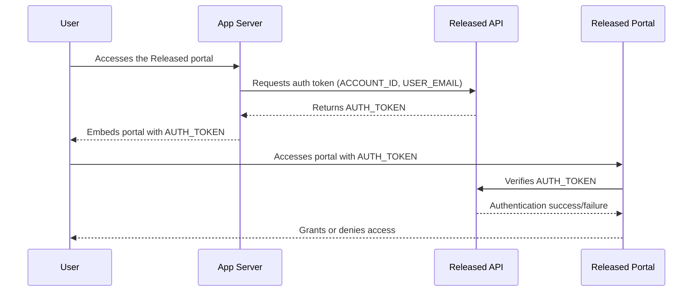

# User Verification

User verification allows you to securely identify users who access your private widgets or pages. By generating a signed
authentication token on your server, you can ensure that only authorized users gain access.

User verification is a great way to control access while providing a seamless experience for your team and customers.

#### Authentication flow



## Setting up user verification

### 1. Get your shared secret

Firstly, get your shared secret to securely encrypt the user data in the payload.

1. Access the global settings via the **Settings** button in the top right of the Released overview page.
2. Go to the **User verification** section.
3. Copy your **Shared Secret** – this will be used to generate authentication tokens.


**Keep your secret safe!** Never expose it in client-side code or public repositories.


### 2. Generate an authentication token on your server

Now you can generate an encrypted `AUTH_TOKEN` to securely identify the user.

Send a **POST** request to the Released token API with your `ACCOUNT_ID` and the `CURRENT_USER_EMAIL` and a
`CURRENT_USER_ID`.
The API will respond with the `AUTH_TOKEN` for that user.

The `CURRENT_USER_ID` will be used to identify the user in Released.
Make sure that this is a unique identifier for each user in your system.
User profiles in Released will use this identifier to match users.

#### Profile information

You can provide optional profile information in the request body to customize the user profile in Released.

```json
{
  "account_id": "ACCOUNT_ID",
  "user_id": "CURRENT_USER_ID",
  "user_email": "CURRENT_USER_EMAIL",
  "profile": {
    "name": "The display name",
    "avatar_url": "https://example.com/avatar.png"
  }
}
```

#### Request body requirements

* `user_id` must be unique for each user in your system. The ID cannot be empty but cannot exceed 255
  characters. It must match the following regular expression: `^[a-zA-Z0-9:_-]{1,255}$`.
* `user_email` must be the email address of the user.
* (optional) `profile.name` must be a string with a maximum length of 200 characters if the field is provided.
* (optional) `profile.avatar_url` must be a valid URL if the field is provided.

**Example Request (Node.js)**

```javascript
const response = await fetch("https://accounts.releasedhub.com/auth/api/impersonation/token", {
  method: "POST",
  headers: {
    "Content-Type": "application/json",
    "Authorization": "Bearer SHARED_SECRET" // Your shared secret
  },
  body: JSON.stringify({
    account_id: "ACCOUNT_ID", // Your Released Account ID 
    user_id: "CURRENT_USER_ID", // ID of the current authenticated user
    user_email: "CURRENT_USER_EMAIL" // Email of the current authenticated user 
    profile: {
      name: "The display name", // The display name of the user
      avatar_url: "https://example.com/avatar.png" // The avatar URL of a user profile picture
    }
  }),
});

const json = await response.json();
console.log(json);
```

You can find the `SHARED_SECRET` and `ACCOUNT_ID` values in the **User verification** settings in Released.
The `CURRENT_USER_EMAIL` and `CURRENT_USER_ID` values should be filled in dynamically with the details of the
authenticated user in your app or site.

Include this token in every request to authenticate users accessing your Released portal.
The initial token you obtain is valid for 2 minutes and will be used to obtain a new token that expires in 7 days.
After that, you must generate a new token.

### 3. Pass the authentication token with the embed tag

Once you’ve generated the token, include it when embedding your portal:

```html

<released-page auth-token="AUTH_TOKEN"></released-page>
```


When a portal has restricted access, the `AUTH_TOKEN` must be included in the embed code for content to appear. Only use
the embed code with authentication tokens in pages that are not publicly accessible.


## Rotating your shared secret

If you need to rotate your shared secret:

1. Generate a new secret from the **User verification** section.
2. Update your server to use the new secret when generating tokens.
3. Ensure all requests are updated with new tokens.

### Need Help? <a href="#need-help" id="need-help"></a>

If you run into issues, [contact us](https://released.so/support) and we’ll help you get started.