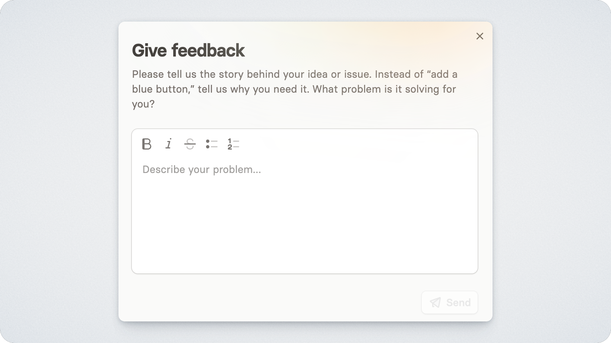

# Feedback

<figure><figcaption></figcaption></figure>

Released makes it easy to collect, manage, and act on customer and stakeholder feedback across your roadmaps. Once enabled, all feedback lands in a centralized inbox where it can be triaged, responded to, and linked to your Jira work.

## Enabling feedback

To enable feedback:



**Open the feedback settings**

Navigate to _Workspace > Settings > Feedback_



**Turn on feedback**

Toggle the feedback switch to enable feedback for the workspace.



Once enabled:

* Users can comment directly on roadmap items via your portal.
* A _Give feedback_ button will appear in the top right of your portal, allowing users to submit general feedback, not tied to a specific roadmap item.

## Where Feedback Goes

All feedback in the Feedback [Inbox](inbox.md). Replies to existing threads do not create new entries but are displayed inline within the original thread.

## Linking Feedback to Jira

Feedback left on roadmap items is automatically linked to the corresponding Jira work item. For other feedback, you can manually link threads from the inbox to any Jira work item. This keeps your team close to customer needs and makes it easy to follow up when work ships.
