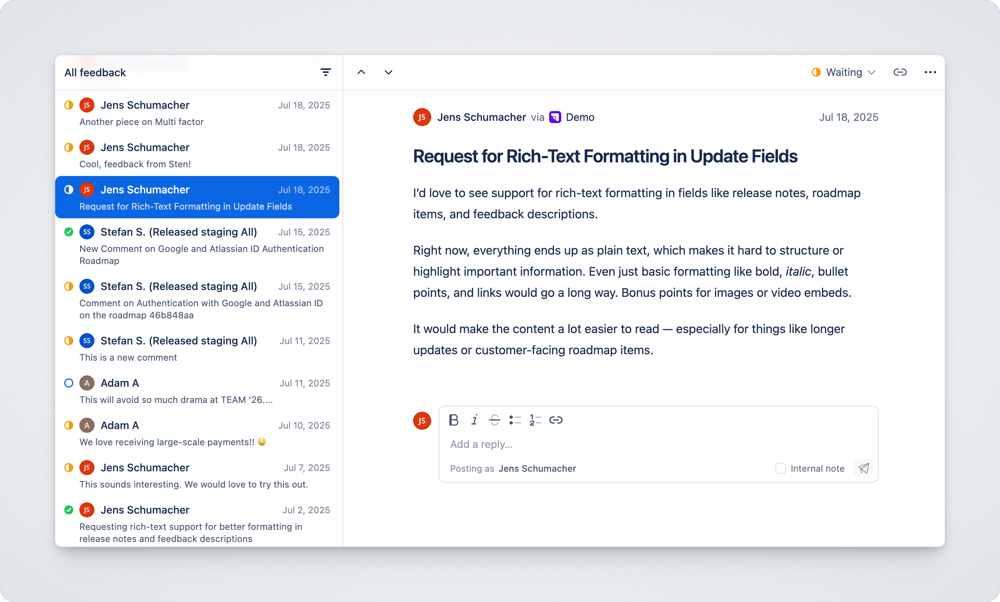

# Inbox

<figure><figcaption></figcaption></figure>

The Inbox is your central place for managing feedback from all your portals — whether it’s a comment on a roadmap item, a reply in a thread, or a suggestion submitted through a standalone form.

Each item in the Inbox represents a feedback thread. A thread is created when:

* A customer submits new feedback using the “Give feedback” form, or
* A user adds a first-level comment on a roadmap item.

All subsequent replies — whether from your team or the customer — are shown within the same thread. This keeps the conversation in one place.

Inside a thread, you’ll see:

* Who gave the feedback&#x20;
* What portal it came through
* The original message
* All public replies (from your team or customers)
* Any internal notes left by your team
* The current status of the thread (e.g. Open, Waiting, Closed)

## Feedback Status

Each feedback item can be marked with a status to track progress internally and externally.

Available statuses:

<table><thead><tr><th width="180.140625">Status</th><th>Description</th></tr></thead><tbody><tr><td><strong>Open</strong></td><td>New or unaddressed feedback.</td></tr><tr><td><strong>Waiting</strong></td><td>Waiting for a response from the customer or stakeholder.</td></tr><tr><td><strong>Closed</strong></td><td>The feedback has been handled or is no longer relevant.</td></tr></tbody></table>

_Tip: You can change status from the keyboard or via the status menu on each feedback item._

## Filtering the Inbox

Use filters to focus on the feedback that matters most. You can currently filter bty the&#x20;

<table><thead><tr><th width="180.015625">Property</th><th></th></tr></thead><tbody><tr><td><strong>Workspace</strong></td><td>Narrow down feedback by its associated workspace.</td></tr><tr><td><strong>Status</strong></td><td>Filter by feedback status (Open, In Progress, Closed).</td></tr></tbody></table>

## Replies

Reply directly to the customer from the Inbox. Replies are public and visible to the customer via the portal or email.

## Internal Notes

Use internal notes to collaborate with your team without notifying the customer.

* Notes are only visible to your team.
* Useful for adding context, tagging teammates, or linking to related work.

## Keyboar shortcuts

| Next feedback     |  j                            |
| ----------------- | ----------------------------- |
| Previous feedback | k                             |
| Reply             | r (or `enter`)                |
| Add internal note | n                             |
| Edit status       | d                             |
| Delete feedback   | ⌫ or Backspace (with confirm) |

***
