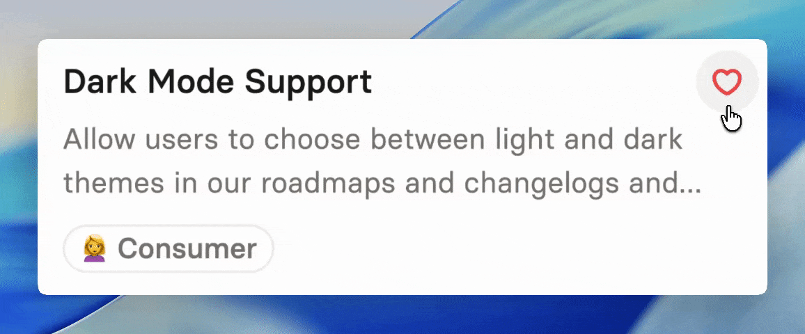

# Wishlists

## Wishlists in the portal

When feedback is enabled, users can add items to their personal wishlist directly in the portal. To add a work item, click the heart icon on any roadmap card.&#x20;

<figure><figcaption></figcaption></figure>

Once added, items appear in the wishlist menu, giving users a quick view of all features or updates they care about most.

The number of items a user can add is controlled by the [wishlist settings](settings.md#maximum-wishes-per-user). Setting a limit ensures that each wish reflects a real priority rather than an exhaustive list of everything a user might want.

## Wishes in Jira

Wishes are also visible and actionable within Jira.&#x20;

### Released roadmaps

On Released roadmaps, each card displays the total number of wishes it has received.&#x20;

<figure><figcaption></figcaption></figure>

### Jira work items

In Jira, a custom field called [_Wish count_](settings.md#wish-count-field) (when configured) shows the total wishes for a work item. This field can be used to filter and sort tickets by popularity.

When a work item has wishes, you can view the list of users who added it in the _Wishers_ section in the work item sidebar.&#x20;


While the wish-count includes wishes across all workspaces, you will only see the wisher names and email addresses from workspaces you have access to. This ensures privacy while still allowing teams to measure interest in features and updates.


### Jira Product Discovery

For Jira Product Discovery (JPD) users, which does not support custom fields, you can [create a number field to store the wish count.](settings.md#configuring-wish-count-in-jira-product-discovery) See the feedback settings for instructions on selecting the appropriate field.

