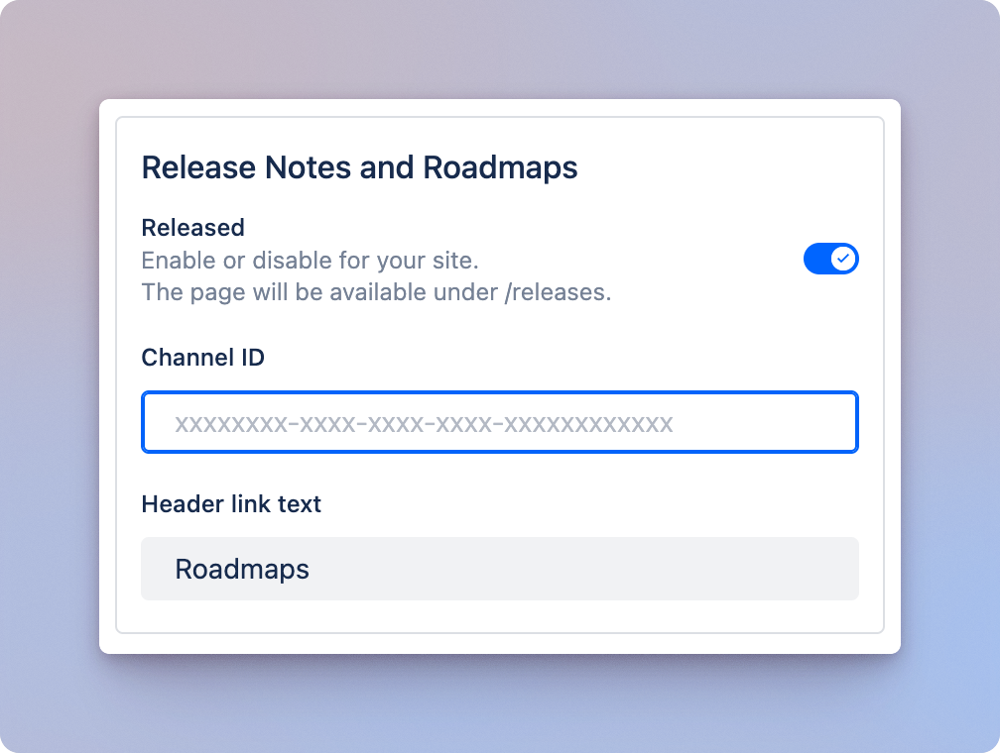

# Scroll Sites for Confluence

[Scroll Sites](https://marketplace.atlassian.com/apps/1211636/scroll-viewport-for-confluence?tab=overview\&hosting=cloud) is an Atlassian marketplace app by [K15t](https://www.k15t.com/) that allows you to transform Confluence pages into a public or restricted online help center for your users.&#x20;

Released integrates with Scroll Sites through a native integration. Setting up this integration is a breeze and requires just a few simple steps, taking less than 2 minutes to complete.


#### See a demo

[https://released.scroll.site](https://released.scroll.site/)


## Installation


### Pre-requisites&#x20;

* [Scroll Sites](https://marketplace.atlassian.com/apps/1211636/scroll-sites-for-confluence-help-centers-blogs-websites) in installed in Confluence.&#x20;
* [Released](https://marketplace.atlassian.com/apps/1230872/released-feedback-portal-public-roadmap-ai-release-notes?hosting=cloud\&tab=overview) is installed in Jira.




**Get the Released Channel ID**

[Find the Channel ID](../../resources/how-tos/finding-the-channel-id.md) for the portal you want to embed and note it down.&#x20;



**Navigate to the integrations section in Scroll Sites**

1. Open the theme configurator under **Site Settings** > **Look and Feel** > **Customize theme**.
2. Click the **Integrations** tab.



**Enable the Released integration**

<div align="left"><figure><figcaption></figcaption></figure></div>





**Enter the Channel ID**

Enter the channel ID noted down in step 1 into the Channel ID field in the Released integration



**Rename the header link (optional)**

The Roadmaps and changelogs will be accessible via a link in the header. Change the link title to best match your use-case.&#x20;



**Save changes**

Click **Save changes** and close the theme configurator.



**Publish the site**

In the _Site settings_ screen, click **Save changes** or **Publish Changes.**



**Congratulations, you're done 🎉**

Roadmaps and posts published with Released will now automatically appear in your Scroll Sites help centre. <br>

***

## Legacy installation

These instructions apply to **Scroll Viewport** and are not applicable to the new **Scroll Sites** app.



**Get the Released Channel ID**

[Find the channel ID](https://docs.released.so/guide/resources/how-tos/finding-the-channel-id) for the announcement page and note it down.



**Create a placeholder page in Confluence**

* Create a page where you want the release notes to appear in your Sites documentation.
* Give the page your preferred name, e.g. "Release Notes".
* Leave the page empty and save.



**Get the Confluence Page ID**

Note down the Confluence **Page ID** from the URL (see screenshot below).

<figure><figcaption></figcaption></figure>



**Add the custom JavaScript snippet to your Viewport theme**

* Navigate to your Sites theme settings.
* [Inject the following JavaScript](https://help.k15t.com/scroll-viewport/inject-custom-javascript).&#x20;

```javascript
if (vp.source.confluencePageId === "PAGE_ID") {
  vp.loadScript('https://embed.released.so/1/embed.js').then(() => {
    document.getElementById("article-content").innerHTML = '<released-page channel-id="CHANNEL_ID" color-scheme="light" color-scheme="light" top-offset="80px" color-primary="#FFF"></released-page>'
  });
}
```


Ensure you replace the **Page\_ID** and **CHANNEL\_ID** placeholders with the IDs noted in the previous steps.&#x20;



