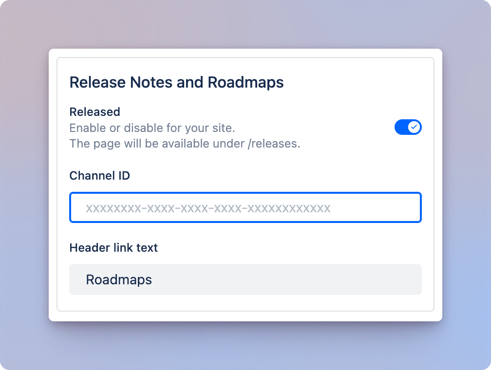

# Scroll Sites for Confluence

[Scroll Sites](https://marketplace.atlassian.com/apps/1211636/scroll-viewport-for-confluence?tab=overview\&hosting=cloud) is an Atlassian marketplace app by [K15t](https://www.k15t.com/) that allows you to transform Confluence pages into a public or restricted online help center for your users.&#x20;

Released integrates with Scroll Sites through a native integration. Setting up this integration is a breeze and requires just a few simple steps, taking less than 2 minutes to complete.


#### See a demo

[https://released.scroll.site](https://released.scroll.site/)


## Installation


### Pre-requisites&#x20;

* [Scroll Sites](https://marketplace.atlassian.com/apps/1211636/scroll-sites-for-confluence-help-centers-blogs-websites) in installed in Confluence.&#x20;
* [Released](https://marketplace.atlassian.com/apps/1230872/released-feedback-portal-public-roadmap-ai-release-notes?hosting=cloud\&tab=overview) is installed in Jira.




**Get the Released Channel ID**

[Find the Channel ID](../../resources/how-tos/finding-the-channel-id.md) for the portal you want to embed and note it down.&#x20;



**Navigate to the integrations section in Scroll Sites**

1. Open the theme configurator under **Site Settings** > **Look and Feel** > **Customize theme**.
2. Click the **Integrations** tab.



**Enable the Released integration**

<div align="left"><figure><figcaption></figcaption></figure></div>





**Enter the Channel ID**

Enter the channel ID noted down in step 1 into the Channel ID field in the Released integration



**Rename the header link (optional)**

The Roadmaps and changelogs will be accessible via a link in the header. Change the link title to best match your use-case.&#x20;



**Save changes**

Click **Save changes** and close the theme configurator.



**Publish the site**

In the _Site settings_ screen, click **Save changes** or **Publish Changes.**



**Congratulations, you're done 🎉**

Roadmaps and posts published with Released will now automatically appear in your Scroll Sites help centre. <br>

## Adding a feedback form


### Pre-requisites&#x20;

A Released form ID (`FORM_ID`).




**Open look and feel settings**

In your Help Center, navigate to: **Site settings** → **Look and feel**.



**Add a header link**

Under the **Section** (header) configuration, create a **new link** in the header navigation.

**Label**: e.g. “Give feedback” (or any label you prefer).

**URL**: Use any URL you like, but note it down; you will need to use the exact same URL in the script below.

> The URL itself does not need to be a real destination; it’s used only as a selector to detect clicks on this link. Although you may pick a real URL as a fallback.



**Add Custom Code**

* In **Look and feel**, go to the **Code** section.
* Paste the following script into the custom JavaScript area.
* Replace:
  * `FORM_ID` with your actual Released form ID.
  * `FEEDBACK_URL` with the exact URL you used for the header link in step 2.

```javascript
(function () {
  const SCRIPT_URL = "https://embed.released.so/1/embed.js";
  const FORM_ID = "b67de5f5-2ece-46ba-aa84-602ab58f40ea";
  const FEEDBACK_URL = "https://released.so/feedback";

  function init() {
    if (!document.querySelector(`released-form[form-id="${FORM_ID}"]`)) {
      const form = document.createElement("released-form");
      form.setAttribute("form-id", FORM_ID);
      document.body.appendChild(form);
    }
    if (!document.querySelector(`script[src="${SCRIPT_URL}"]`)) {
      const script = document.createElement("script");
      script.src = SCRIPT_URL;
      script.defer = true;
      document.head.appendChild(script);
    }
  }

  if (document.body) init();
  else document.addEventListener("DOMContentLoaded", init);

  document.addEventListener("click", function (e) {
    const selector = `a[href="${FEEDBACK_URL}"]`;
    const link =
      e.target.closest(selector) ||
      e.target.closest("li")?.querySelector(selector);
    if (!link) return;

    e.preventDefault();
    e.stopImmediatePropagation();

    window.Released?.show("form", FORM_ID);
  }, true);
})();
```



**Save and publish**

* Click **Save** in the Look and feel settings.
* **Publish** the site so the changes go live.



***

## Legacy installation

These instructions apply to **Scroll Viewport** and are not applicable to the new **Scroll Sites** app.



**Get the Released Channel ID**

[Find the channel ID](https://docs.released.so/guide/resources/how-tos/finding-the-channel-id) for the announcement page and note it down.



**Create a placeholder page in Confluence**

* Create a page where you want the release notes to appear in your Sites documentation.
* Give the page your preferred name, e.g. "Release Notes".
* Leave the page empty and save.



**Get the Confluence Page ID**

Note down the Confluence **Page ID** from the URL (see screenshot below).

<figure><figcaption></figcaption></figure>



**Add the custom JavaScript snippet to your Viewport theme**

* Navigate to your Sites theme settings.
* [Inject the following JavaScript](https://help.k15t.com/scroll-viewport/inject-custom-javascript).&#x20;

```javascript
if (vp.source.confluencePageId === "PAGE_ID") {
  vp.loadScript('https://embed.released.so/1/embed.js').then(() => {
    document.getElementById("article-content").innerHTML = '<released-page channel-id="CHANNEL_ID" color-scheme="light" color-scheme="light" top-offset="80px" color-primary="#FFF"></released-page>'
  });
}
```


Ensure you replace the **Page\_ID** and **CHANNEL\_ID** placeholders with the IDs noted in the previous steps.&#x20;



