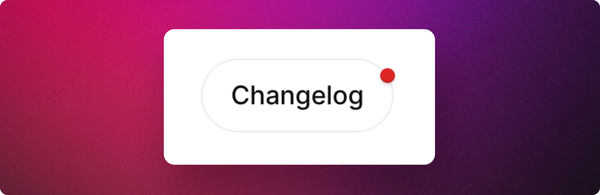

# Page Embed

The embed page enables you to integrate a portal seamlessly into your website or documentation. You can maintain your existing website header and footer, ensuring a consistent user experience across your site.&#x20;

## Demo

Experience a demo of the page embed on [CodePen](https://codepen.io/released/pen/WNaaMNx).

## Configuration

To customize the appearance of your embedded portal, go to **Workspace > Settings > Page**.

The page embed settings allow you to tailor the look and feel of the page to match your brand or audience. From the right-hand sidebar, you are able to change the title and subtitle, color scheme, locale and more. &#x20;

Alternatively you can use the [advanced options](announcement-page.md#advanced-options) below to specify the configuration via code.&#x20;

## Installation

To embed the portal in your website:



#### Click the install button

Click the Install button at the bottom of the configuration sidebar.&#x20;



#### Copy the install code

Follow the instructions in the install panel. Copy the relevant code snippets and paste them into your website or app.&#x20;



## Advanced options

### Overwriting the UI settings

You can overwrite the configured styles and settings of the page by adding custom properties to the embed code. This allows for customizing the styling when embedding the page in different locations.&#x20;


When a setting is configured via the properties below, it can no longer be customized via the UI settings.&#x20;


The properties are specified as attributes within the `<released-page>` custom HTML element.

### Page properties

<table data-full-width="false"><thead><tr><th width="204">Property</th><th width="588">Description</th><th data-hidden></th></tr></thead><tbody><tr><td><code>channel-id</code></td><td>The ID of the release notes channel.</td><td></td></tr><tr><td><code>module</code></td><td>Determines with modules to show on the page. Can be <code>changelog</code> , <code>roadmap</code> or <code>all</code>. Defaults to <code>all</code>. </td><td></td></tr><tr><td><code>header</code></td><td>Can be <code>true</code> or <code>false</code>. If false, the header with the title and description is hidden. This options allows you use an existing header or create a completely custom header. </td><td></td></tr><tr><td><code>cover-images</code></td><td>Determines whether the cover image will be shown. Can be <code>true</code> or <code>false</code>.  </td><td></td></tr><tr><td><code>title</code></td><td>The title of the widget.</td><td></td></tr><tr><td><code>sub-title</code></td><td>The subtitle of the widget.</td><td></td></tr><tr><td><code>color-scheme</code></td><td>The color scheme to use for the widget. Can be <code>system</code>, <code>dark</code>, or <code>light</code>. See <a data-mention href="../../../resources/how-tos/configuring-dark-mode.md">configuring-dark-mode.md</a> for more details.</td><td></td></tr><tr><td><code>color-primary</code></td><td>The primary UI color. Can be hex, hsl, rgb, or css color name.</td><td></td></tr><tr><td><code>top-offset</code></td><td>Expects a number (eg. <code>100</code>) or <code>false</code> as values. <br>A value of <code>100</code> will create an offset of 100 pixels from the top for sticky titles. A value of <code>false</code> will disable sticky titles.</td><td></td></tr><tr><td><code>z-index</code></td><td>The z-index to use for the widget.</td><td></td></tr><tr><td><code>locale</code></td><td><p>The locale to use for the page. Can be:</p><p></p><ul><li><code>en</code> 🇺🇸 American English</li><li><code>de</code> 🇩🇪 German</li><li><code>fr</code> 🇫🇷 French</li><li><code>es</code> 🇪🇸 Spanish</li><li><code>pt</code> 🇵🇹 Portuguese</li><li><code>nl</code> 🇳🇱 Dutch</li><li><code>zh</code>  🇨🇳 Chinese</li></ul></td><td></td></tr></tbody></table>

### Notification badge

To notify users about the availability of a new post, you can enhance the user experience by incorporating a notification badge on the link or button leading to the announcement page. This badge functions similarly to the notification badge found in the widget.

<figure><figcaption><p>The notification badge let's users know when a new update is available. </p></figcaption></figure>

#### Installing the badge


**The badge must be installed on the same domain as the page embed**

The badge script uses localStorage to maintain the "last seen" status. localStorage is specific to the domain or origin where the script operates. This means that a badge embedded in your app cannot determine the read status from your website or the hub, as they are on different domains.


Follow the **Installation instructions** and copy the code for the badge.&#x20;

It's best to place the `<release-badge>` element inside the `<a>` tag when adding the badge to a link.&#x20;

```html
<a href="/changelog" class="nav-link">What's New? <released-badge channel-id="CHANNEL_ID"></released-badge></a>
```

#### Adjusting the position of the badge

You can adjust the position of the badge by styling it with CSS. We recommend two options:&#x20;

* Use the margin property to adjust the position
* Use the transform property to adjust the position&#x20;

```html
<style>
released-badge {
  margin-top: -8px;
  margin-right: -8px; // example with margins
  transform: translate(50%, -50%); // example of transform
}
</style>
```


Experiment with badge positioning on [CodePen](https://codepen.io/released/pen/abQRYgG).

