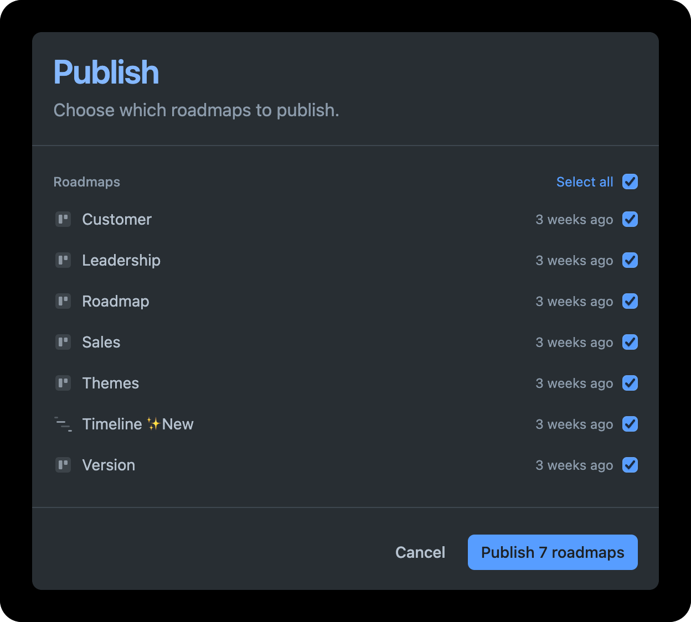

# Publishing

Publishing a roadmap makes it visible on your public portal, so customers and stakeholders can stay aligned on what’s coming next.

You can publish a single roadmap or multiple roadmaps at once, helping you tailor views for different audiences — such as customers, internal teams, or executive stakeholders.

As your team works and things change, you can update and re-publish your roadmap in just a couple of clicks. No need to manually edit each one.

## Publishing

To publish your roadmap, click the "Publish" button in the top right corner.&#x20;

<figure><figcaption></figcaption></figure>


The roadmap navigation item in the portal or embeds well only show if at least one roadmap has been published and the roadmap module has been enabled.


## Unpublishing&#x20;

To unpublish the roadmap view, simply press the unpublish icon right next to the publish button. Your roadmap will be immediately unavailable on the page embed.&#x20;
