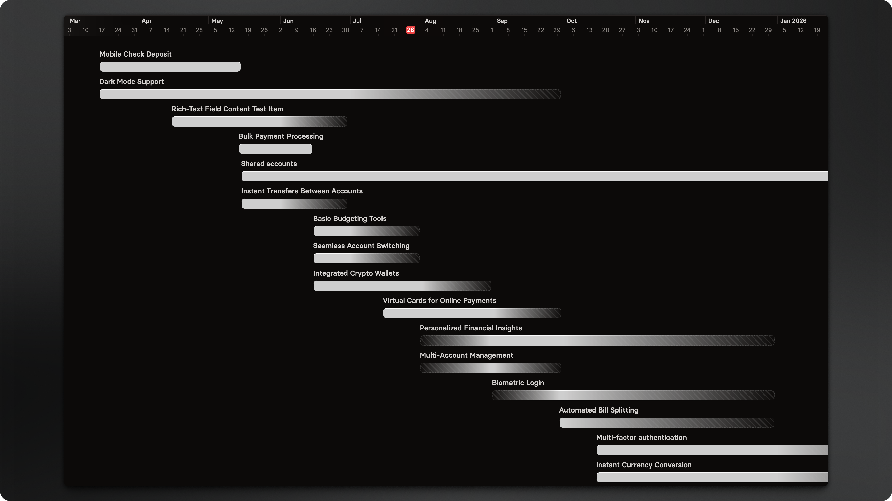

# Views

## Board view

<figure><figcaption></figcaption></figure>

For most roadmap communication, the Board view is ideal — it shifts the focus from specific dates to broader goals, priorities, or any structure you define.

Because Roadmaps in Released are highly flexible — allowing you to include work items from multiple projects — each view type requires a bit of setup. You’ll find setup instructions for each view below.

#### Configuration

Map work items to columns on the roadmap based on their status or field options. This can include criteria such as teams, quarters, priority, and more.

To customize the column mapping:&#x20;



Select **Display options**




Click **Edit columns**




Select the field you want to map for each project




Map your field options by dragging them to the corresponding column



#### Supported field types

The following field types are currently supported for column mapping.

• Status

• Select (Multi-select is not yet supported)

• Version

Support for additional field types, including date-based columns, is planned for future updates. Please [let us know](https://released.so/support) if you would like us to support a specific field type.&#x20;

## Timeline view

<figure><figcaption></figcaption></figure>

Timeline roadmaps provide a visual, Gantt-style bar chart of your project schedule — showing when work starts and ends, how phases connect, and where dependencies exist.

This format helps teams and stakeholders quickly grasp the full project plan, track progress, and manage sequencing.

Since confidence in delivery dates decreases the further out you plan, using fuzzy dates (months or quarters) help communicate uncertainty clearly. This gives stakeholders a more accurate picture of what’s planned — and how fixed or flexible those plans are.

#### Configuration

For each project, you can define which start and end date fields should be used to position items on the timeline. Released will make an initial best guess based on your project data, but you can update these fields at any time.

<figure><figcaption>
Date field configuration for the timeline view
</figcaption></figure>

This gives you the flexibility to use different date fields across different projects — ideal if teams track timelines in different ways.
