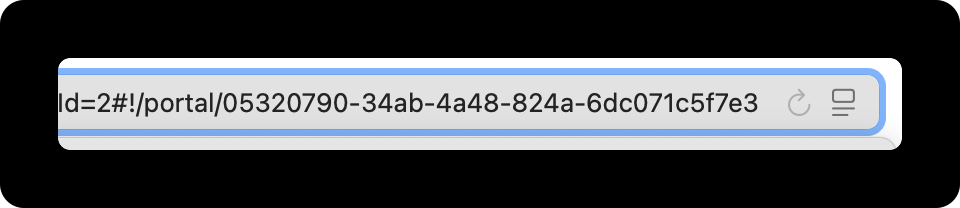

# Change The Portal URL (Slug)

Currently the portal URL can only be updated via the API. The easies way to do so is via the browser [console](how-to-open-the-developer-console-to-check-for-errors.md). <br>

Here are the steps you'll need to take: <br>



### Copy the portal ID

Navigate to you workspace Dashboard.&#x20;

Copy the portal ID from the URL toolbar. It's a 32 character string at the end of the URL, right after `portal/` .

<figure><figcaption></figcaption></figure>



### Open the browser console

You can find instructions on how to open the browser console here.



### Enter the API code

In the console, enter the following code.&#x20;


```javascript
apiFetch('/internal/api/stream/xxxxxxxx-xxxx-xxxx-xxxx-xxxxxxxxxxxx', { method: 'PATCH', body: JSON.stringify({ slug: 'newslug' }) })
```


Please replace the ID placeholder marked with "x" and insert the "new slug"

Hit Enter to execute the call.&#x20;



### Reload the page

Reload the dashboard and you see the updates slug in the portal URL in the top.&#x20;





## Need help?&#x20;

Feel free to schedule a [15 minute call](https://cal.com/released/15min) and we will help assist you with the renaming.&#x20;

<br>

<br>

<br>

