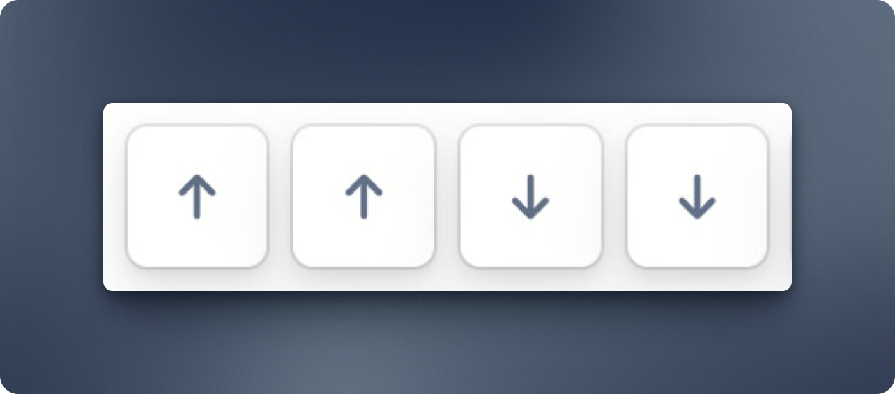

# Feedback Beta


**Welcome to the Feedback beta!** \
\
Please note that the Feedback feature is still in beta. Found bugs or have suggestions? Please let us know: [https://released.so/support](https://released.so/support)


## Getting started



### Open feedback settings

Go to the Settings section of the Workspace where you want to enable Feedback and click on "Feedback" in the settings sidebar.&#x20;



### Enter the beta code

On the settings screen, enter the following beta code.

<figure><figcaption></figcaption></figure>


As you type, the symbols should appear on screen. If they don’t, click anywhere on the page to make sure it’s active and accepting input.




### Login via Atlassian&#x20;

For the feedback to work, you will have to login via Atlassian to complete your profile.&#x20;



### Enable feedback&#x20;

Click the switch to enable feedback.&#x20;



## Inbox

You can access incoming feedback from the Global Inbox. Click on Overview and you’ll find the inbox at the top of the page. From there, you can filter feedback by status and portal to focus on what matters most.

## Questions & Feedback

If you have any questions or feedback, please get in touch via [https://released.so/support](https://released.so/support) or leave feedback in the Portal: [https://hub.released.so/beta/roadmap](https://hub.released.so/beta/roadmap/59452a14)

We are looking forward to hear what you think!&#x20;
