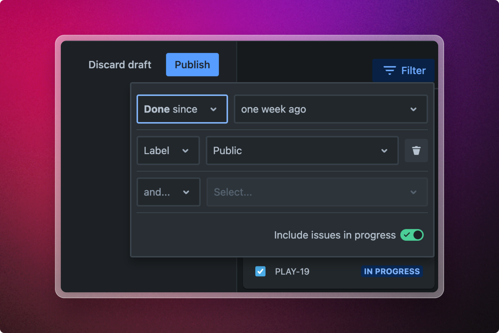

# Filter

<figure><figcaption>
Issue filter in the staging area
</figcaption></figure>

## Overview

The panel on the right hand side of the post editing view is called the staging area.&#x20;

The staging area makes it a breeze to review issues before they get added to the announcement. Issues are sorted by type, so you can easily spot new features, minor improvements, and bug fixes.

## Changelog filter settings&#x20;

The changelog filter settings form the foundation of the filter that determines which issues to include in your changelog.&#x20;

Access the filter settings in your workspace under  **⚙ Settings > Filter**.

### Jira projects

Your Jira project settings define which issues are included in your changelog. You can choose a single project or include issues from multiple projects in your updates.

To include issues from multiple projects&#x20;

1. Click the multi-select project dropdown to expand the dropdown list.
2. Review the list of available projects and select the ones that you want to include in your Release Notes.&#x20;
3. Your selection will be automatically saved.&#x20;


If a project administrator does not have view permission for a previously added project, the project name will be obfuscated.


### Version field

Select which version field to use when filtering by version. The field defaults to the standard "Fix versions", but allows you to specify any custom single or multi-version field.&#x20;

## Filter

Using the filter in a post allows you to narrow down the list of Jira work items to include in your post. The basic filter provides the following filter options

### Basic filter options

<table><thead><tr><th width="260.5">Filter</th><th>Description</th><th data-hidden></th></tr></thead><tbody><tr><td><strong>Done since</strong> </td><td>Include issues moved into the done status category since a specific date. This filter uses the <code>statusCategoryChangedDate</code> to determine the date. </td><td></td></tr><tr><td><strong>Version</strong></td><td>Include issues with a specific version. </td><td></td></tr><tr><td><strong>Label</strong></td><td>Include issues with a specific label.</td><td></td></tr><tr><td><strong>Issue type</strong></td><td>Include specific types of issues.</td><td></td></tr><tr><td><strong>Jira filter</strong></td><td>Add a <a href="https://support.atlassian.com/jira-software-cloud/docs/save-your-search-as-a-filter/">Jira filter</a>. See below for details. </td><td></td></tr></tbody></table>

### Jira filter

To access more powerful filtering capabilities, you can add a [Jira filter](https://support.atlassian.com/jira-software-cloud/docs/save-your-search-as-a-filter/) to narrow down the list of issues. Using JQL and Jira's advanced filtering capabilities, Jira filters give you the ability to filter based on any available fields.&#x20;
