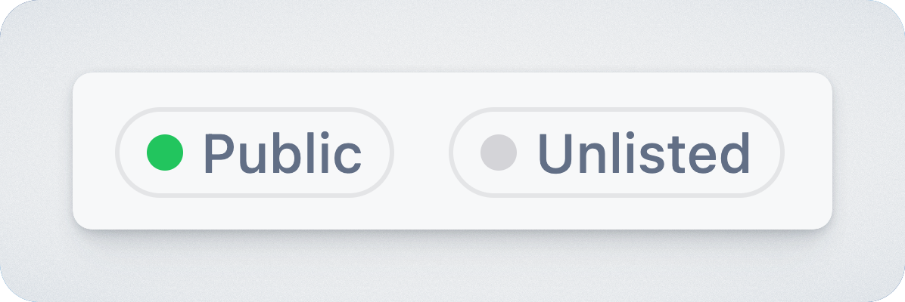

# Dashboard

## Overview

The Workspace Dashboard shows activity across your workspace. It includes view metrics, roadmap publishing history, and changelog posts. Use it to monitor engagement and keep track of what has been published.

## Dashboard sections

### Portal details

At the top of the dashboard, you’ll see the **name of the workspace**. Just below it is the **Portal URL** where the workspace content is accessible to stakeholders and customers. This is the link you can share with others.

To the right of the URL, you will find two lozenges indicating the portals **access** and **visibility** .

<figure><figcaption>
Visibility &#x26; Access
</figcaption></figure>

#### Access

<table data-header-hidden><thead><tr><th width="139.00390625">Value</th><th>Meaning</th></tr></thead><tbody><tr><td><strong>Internal</strong></td><td>Access to the portal is available to users with an approved internal email domain.</td></tr><tr><td><strong>Restricted</strong></td><td>Access to the portal is available to authorized users outside your organization.</td></tr><tr><td><strong>Public</strong></td><td>Access to the portal is open to the public.</td></tr></tbody></table>

#### Visibility

<table data-header-hidden><thead><tr><th width="139.00390625">Value</th><th>Meaning</th></tr></thead><tbody><tr><td><strong>Listed</strong></td><td>Portals are visible on the Product Hub overview page.</td></tr><tr><td><strong>Unlisted</strong></td><td>Portals are not visible on the Product Hub overview page, but can still be accessed via a direct link to the portal .</td></tr></tbody></table>

These indicators help you confirm how widely your updates are visible and whether the link is safe to share with external stakeholders. For more details, see the [access.md](settings/access.md "mention") settings.&#x20;

### Views

At the top of the dashboard, you’ll see key view metrics of your portal:&#x20;

* Total views
* Portal views
* Embed views
* Average views.&#x20;

These numbers give you an idea of how often your content is being accessed and from where.

Below the summary, the graph shows how views are trending over time. You can adjust the time range (24 hours, 7 days, 14 days, 30 days, or 3 months) to see how engagement changes.&#x20;

### Linked projects

This section lists Jira projects that are currently connected to your workspace. It gives you a quick way to confirm which projects are contributing issues to roadmaps and updates. Clicking a project takes you to the linked Jira project.

### Publishing&#x20;

This section helps you understand where your updates are going and who is receiving them.

#### Confluence

If Confluence is connected, you will see a link to the Confluence page to which updates can be published.&#x20;

#### Email

If email is enabled, you’ll also see the number of subscribers.&#x20;

### Roadmaps

All roadmaps in the workspace are listed here, along with the last time each one was published. This gives you a quick reference for what’s current and what might need updating. Clicking a roadmap opens it directly.

### Changelog

At the bottom of the dashboard, you’ll find the changelog section. On the left is a list of published posts, including their titles, authors, publish dates, and view counts. Each post includes actions to edit the post or share it via Slack.&#x20;

On the right, you’ll see any drafts you’ve saved but haven’t published yet. If there are no drafts, the area will indicate that. You can create a new post from here using the + Create post button.

### Resources

The right-hand panel includes shortcuts to relevant documentation. You can access onboarding material, recent product updates, a full user guide, and the help center. These links are useful if you’re getting started or need to troubleshoot something quickly.
