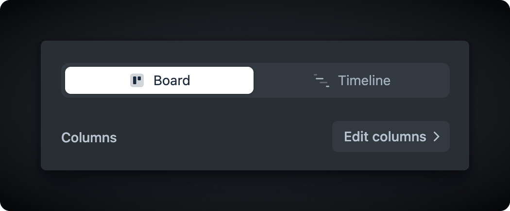

# Roadmaps


Roadmaps Demo


## Overview

Create internal or customer-facing roadmap views directly from your Jira issues. Customize the view by selecting the fields to display and adding detailed descriptions of your plans. Since the data is stored on the issue, your view will always be up to date.

## Use-cases

Use Roadmap views to communicate plans to customers or stakeholders. Released roadmaps are highly flexible and can work across projects, enabling you to consolidate work from various teams as needed.

Released roadmaps are perfect for:

* Public roadmaps
* High touch customer communication &#x20;
* Stakeholder updates

## Creating a roadmap

Aside from the initial creation via the empty state, there are 3 ways to create additional roadmaps in a workspace.&#x20;

#### Roadmap dropdown

You can create a new roadmap using the **roadmap selector** found in the breadcrumbs navigation.

<figure><figcaption>
Roadmap selector
</figcaption></figure>

#### More (⋯) menu

The more (**⋯**) menu offers a range of options for managing the current roadmap and also provides the ability to create a new roadmap.

<figure><figcaption></figcaption></figure>

#### Save as new

When adjusting the filter or display options of a roadmap, you can either save the current roadmap or use the dropdown arrow to **Save as new** and create a separate version.

<figure><figcaption></figcaption></figure>

## Content configuration

### Linked projects&#x20;

Roadmap views can display issues from multiple Jira projects. To include issues from a specific project on your roadmap, simply add that project to the [linked projects](settings/general.md#linked-projects) within the space.

### Filter

Use filters to refine the issues displayed on the roadmap. You can apply basic filters such as issue type or labels, or utilize JQL for more advanced filtering options.

<figure><figcaption>
Use JQL to create an advanced filter.
</figcaption></figure>

## Display option

### Views conflguration

Choose between Board and Timeline views based on your needs.

For most roadmap communication, the Board view is ideal — it shifts the focus from specific dates to broader goals, priorities, or any structure you define.

When you need to align on delivery dates, switch to the Timeline view to support that conversation.

<figure><figcaption></figcaption></figure>

Because Roadmaps in Released are highly flexible — allowing you to include work items from multiple projects — each view type requires a bit of setup. You’ll find setup instructions for each view below.

#### Column mapping (Board)

<figure><figcaption>
Column mapping
</figcaption></figure>

Map issues to columns on the roadmap based on their status or field options. This can include criteria such as teams, quarters, priority, and more.

To customize the column mapping:&#x20;

1. Select **Display options.**
2. Click **Edit columns.**
3. Select the field you want to map for each project.
4. Map your field options by dragging them to the corresponding column.&#x20;

#### Supported field types

The following field types are currently supported for column mapping.

• Status

• Select (Multi-select is not yet supported)

• Version

Support for additional field types, including date-based columns, is planned for future updates. Please [let us know](https://released.so/support) if you would like us to support a specific field type.&#x20;

#### Date field configuration (Timeline)

<figure><figcaption>
Date field configuration for the timeline view
</figcaption></figure>

For each project, you can define which start and end date fields should be used to position items on the timeline. Released will make an initial best guess based on your project data, but you can update these fields at any time.

This gives you the flexibility to use different date fields across different projects — ideal if teams track timelines in different ways.

### Field configuration

Released roadmaps support a variety of custom field types that can be displayed on the card or in the detail view.&#x20;

To add a field to the view, click the `+` icon next to the field names in the **Available Fields** section. By default, the field will appear on both the compact card on the board and the detailed (dialog) view. Use the checkboxes to show or hide fields in each respective view.

<figure><figcaption>
Field settings
</figcaption></figure>

#### **Title**

The issue Summary field will be used as the default title. The title field is always displayed on both the board and the detailed view and cannot be unchecked. To change the title field, click the `T` icon next to any compatible text field.

#### **Public description**

The public description is a special <mark style="background-color:yellow;">system field</mark> that can only be edited within a Released board. It leverages the same rich-text editor as the changelog, allowing you to easily embed images and videos (like Youtube and Loom). \
\
In the board view, the public description is automatically truncated. To display an alternative description, you can hide the public description field and show a short text field instead.

#### Field ordering

You can adjust the order in which fields are displayed on the card and in the detail view by dragging and dropping the fields in the list. Note that the order of the title and description field can not be changed.&#x20;

#### Available field types

* Short text
* Status
* Flagged
* Labels&#x20;
* Date / Time-date
* Select
* Multi-select
* Issue type
* Checkboxes
* Radio Buttons
* Rating (Jira Product Discovery)

### Editing the public description

The public description is a Released system field that can not be changed.&#x20;

Click on a card within a Released roadmap view to edit the public description inline. Add text, images or videos to the description. See the [editor](changelog/editor/ "mention") documentation for details.&#x20;

### Editing issue details

Fields other than the public description can be edited on the full issue view.&#x20;

To open the issue view:

* Click on the issue key lozenge when hovering over a card, or
* Click on **Edit issue** from the card detail view.&#x20;

### Publishing

To publish your roadmap, click the "Publish" button in the top right corner.&#x20;

Once a roadmap has been published, a switch will appear on the page embed. Allowing you to navigate between the Changelog and the Roadmap.

<figure><figcaption>
Switch between changelog and roadmap.
</figcaption></figure>

### Unpublishing&#x20;

To unpublish the roadmap view, simply press the unpublish icon right next to the publish button. Your roadmap will be immediately unavailable on the page embed.&#x20;

### Delete

You can delete a roadmap through the More (⋯) menu in the top-right corner. Deleting a roadmap also unpublishes it, immediately removing it from the portal view.

<figure><figcaption></figcaption></figure>
