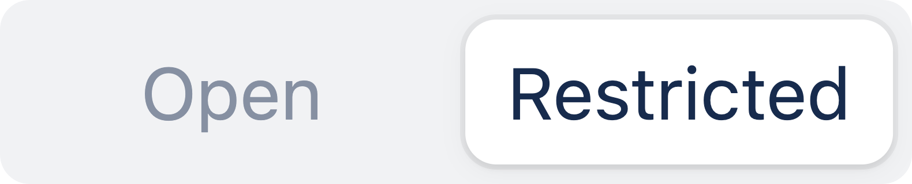
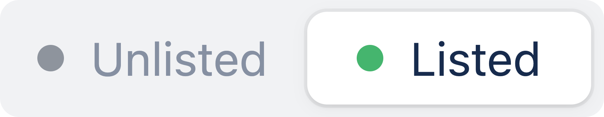
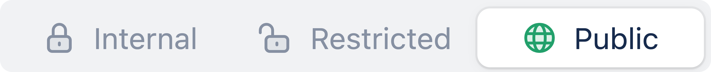

# Access

## Overview

The access settings allow you to control who can create and publish content in the workspace and who can access the portal.&#x20;

## Workspace&#x20;

Manage who can access and create content in your workspace.&#x20;

### Access

Content creation and publishing are restricted to users who have access to the linked Jira projects.

<figure><figcaption>
Workspace access
</figcaption></figure>

Available access levels are:

<table data-header-hidden><thead><tr><th width="139.00390625"></th><th></th></tr></thead><tbody><tr><td><strong>Open</strong></td><td>Everyone with access to the Jira site can view and edit content in the workspace. </td></tr><tr><td><strong>Restricted</strong></td><td>Only users with access to the linked Jira project(s) can view and edit content in this workspace, depending on their level of access in the Jira project(s). </td></tr></tbody></table>

If a workspace is linked to multiple Jira projects, users must have access to at least one of those projects to access the workspace.


Users will only be able to see issues and fields for which they have the necessary permissions.


## Portal&#x20;

Manage who can access and view the portal.&#x20;

### Portal URL

Displays the URL through which the portal is accessible. Support for changing the portal URL will be available in a future release.

### Visibility

Control whether the portal will be listed on the Product Hub or whether it's only reachable directly via the portal URL.&#x20;

<figure><figcaption>
Portal visibility
</figcaption></figure>

<table data-header-hidden><thead><tr><th width="139.00390625"></th><th></th></tr></thead><tbody><tr><td><strong>Listed</strong></td><td>Portals are visible on the Product Hub overview page.</td></tr><tr><td><strong>Unlisted</strong></td><td>Portals are not visible on the Product Hub overview page, but can still be accessed via a direct link to the portal .</td></tr></tbody></table>

### Access

The access setting controls who can view the portal on Product Hub or when embedded in a website or app.

To grant access,  select one of the three available access levels.

<figure><figcaption>
Portal access levels
</figcaption></figure>

#### :unlock: Internal

The internal access setting has been designed to make it easy to grant access to users within your organization.&#x20;


Best for stakeholder / internal communication.


<table data-header-hidden><thead><tr><th width="245"></th><th></th></tr></thead><tbody><tr><td><strong>Member access</strong></td><td>Anyone with access to the workspace will be able to access the portal from internal links. </td></tr><tr><td><strong>Internal domains</strong></td><td>Anyone with an email address that matches one of the configured "internal domains" will be able to access the portal. Internal domains can be configured by Released administrators in the <a href="../../product-hub/internal-domains.md">global settings</a>. </td></tr></tbody></table>

#### :closed\_lock\_with\_key: Restricted

Access to the portal is available to authorized users outside your organization.


Best for restricted communication with a small number of select customers.&#x20;


<table data-header-hidden><thead><tr><th width="244"></th><th></th></tr></thead><tbody><tr><td><strong>Customers</strong></td><td>Anyone who has been identified via SSO or the client side SDK can access the portal.</td></tr><tr><td><strong>Email domains</strong></td><td>Anyone with an email address at these domains can access the portal.</td></tr><tr><td><strong>Individuals</strong></td><td>The portal is accessible to individuals with the following email addresses.</td></tr></tbody></table>

#### :globe\_with\_meridians: Public

Access to the portal is open to the public. Everyone with a direct link to the portal will be able to access it, even if the portal is [not listed ](access.md#visibility)on the Product Hub.&#x20;


Best for public release notes embedded on your website or app.

