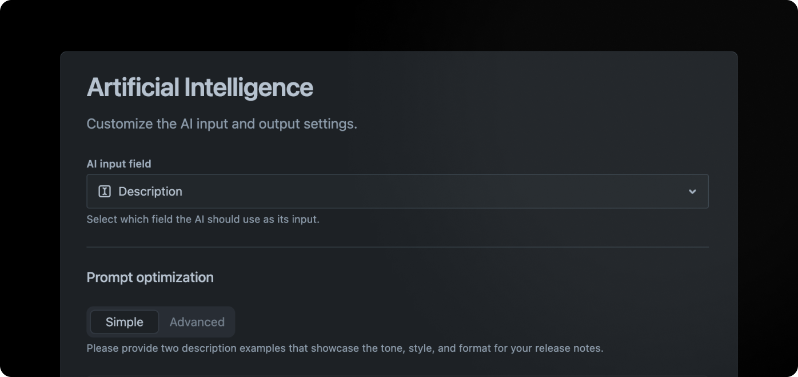

# Artificial Intelligence

<figure><figcaption></figcaption></figure>

## Overview

Use the AI settings to fine-tune the AI-generated descriptions by providing examples that match your brand's unique tone and style. This way, you’ll keep every post consistent and on-brand.

## Basics

The advanced AI prompts of Released have undergone meticulous fine-tuning to produce release notes from an array of Jira issue descriptions. However, achieving a universally perfect prompt catered to every content type is challenging.

To guarantee that the AI output meets your expectations, you have the option to personalize the prompt, molding it to suit your distinct content requirements.


**Custom prompts are not a guarantee**\
It's important to note that the resulting description might not strictly follow your input. Your personalized prompts serve as navigational tools for guiding Released's content creation in the desired direction, leading to reduced editing efforts. However, it's essential to understand that a custom prompt does not ensure an infallible or guaranteed result.


To access the AI settings, click on **Settings > Artificial intelligence** in the sidebar navigation.

### AI input field

By default, the issue **summary** (also known as title), and the **description** are used as input for the AI. That's the content it uses to create the public description.

However, if your team uses the **description** field to capture technical details or just generally content that can not be used to generate a meaningful description, you have the option to select a different field as input.

<figure><figcaption>
AI input field setting
</figcaption></figure>

The AI input field dropdown contains all fields of type "Paragraph". Please make sure that the field is configured for all issue types you intend to include in your update.

If the field selected for the **AI input field** is _not available_ on a given issue, the AI will fallback to the standard description field as input.


**Using multiple fields**

Released lets you select a single AI input field, but you can include additional issue fields by copying them into that field using Jira automation. Read the [accessing-custom-fields.md](../../how-tos/accessing-custom-fields.md "mention") guide for more detail.&#x20;


### Prompt optimization

Optimize the AI prompt using one of two modes:

1. **Simple** - The simplest way to optimize your prompt. Provide two description examples that showcase the tone, style, and format for your release notes. The examples should describe one feature. Refer to the defaults as a guide.
2. **Advanced** - For people experiences with prompt engineering. Gives you more control over the prompt that is used to generate the AI description.

### Issue specific prompts

Enhance your prompt by incorporating issue-specific instructions, customizing the desired response length, adjusting the tone of voice, or requesting the AI to provide additional context as needed.

Issue specific prompts provide you the flexibility to adopt a playful tone while crafting feature descriptions and maintain a professional tone when communicating security vulnerabilities.

<figure><figcaption>
AI Issue Specific Prompt
</figcaption></figure>

#### Format

The formatting option empowers you to tailor the length of the generated description. For instance, bug-fixes usually warrant succinct, one-sentence explanations, while major features can be elaborated upon with a couple of paragraphs.

#### Custom prompt

With the custom prompt option, you can go beyond the pre-configured choices to personalize formatting and tone of voice according to your preferences. Additionally, feel free to include any extra instructions you'd like.

## Tips for writing a good base prompt

| Tip                                                                                                                          | ✅ Good                                                                                                                                          | 🚫 Bad                                                                           |
| ---------------------------------------------------------------------------------------------------------------------------- | ----------------------------------------------------------------------------------------------------------------------------------------------- | -------------------------------------------------------------------------------- |
| Utilize custom prompts as instructional tools. Focus on guiding language.                                                    | Utilize metaphors to clarify complex concepts.                                                                                                  | Please incorporate metaphors.                                                    |
| Keep in mind that language models can struggle with negations. To enhance results, it's advisable to rephrase custom prompts | Avoid details that aren't relevant.                                                                                                             | Do not include details that aren't relevant.                                     |
| Use examples                                                                                                                 | 
Use the following examples as a guide for writing style and tone of voice:  Example 1: [Example here] Example 2: [Example here]
 | No example provides                                                              |
| Express custom tones of voice as adjectives.                                                                                 | Motivational, philosophical, and cheeky.                                                                                                        | Injecting humor, projecting authority, and emulating Shakespearean style.        |
| Incorporating conjunctions (such as 'and') is acceptable, although brevity in your tone is preferable for optimal results.   | Lively and engaging.                                                                                                                            | Example is: lively, engaging, concise, inspirational, and authentically genuine. |
